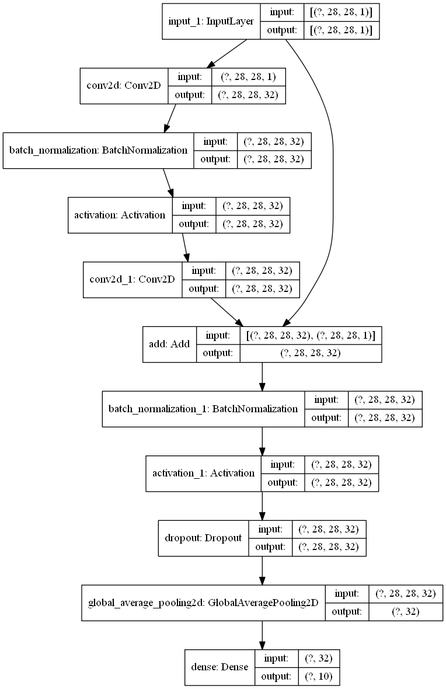

```python
from tensorflow import keras
import numpy as np
from pyradox import modules
```


```python
inputs = keras.Input(shape=(28, 28, 1))
x = modules.ConvSkipConnection(32, batch_normalization=True, dropout=0.2)(inputs)
x = keras.layers.GlobalAvgPool2D()(x)
outputs = keras.layers.Dense(10, activation="softmax")(x)

model = keras.models.Model(inputs=inputs, outputs=outputs) 
```


```python
model.summary()
keras.utils.plot_model(model, show_shapes=True, expand_nested=True)
```

    Model: "model"
    __________________________________________________________________________________________________
    Layer (type)                    Output Shape         Param #     Connected to                     
    ==================================================================================================
    input_1 (InputLayer)            [(None, 28, 28, 1)]  0                                            
    __________________________________________________________________________________________________
    conv2d (Conv2D)                 (None, 28, 28, 32)   320         input_1[0][0]                    
    __________________________________________________________________________________________________
    batch_normalization (BatchNorma (None, 28, 28, 32)   128         conv2d[0][0]                     
    __________________________________________________________________________________________________
    activation (Activation)         (None, 28, 28, 32)   0           batch_normalization[0][0]        
    __________________________________________________________________________________________________
    conv2d_1 (Conv2D)               (None, 28, 28, 32)   9248        activation[0][0]                 
    __________________________________________________________________________________________________
    add (Add)                       (None, 28, 28, 32)   0           conv2d_1[0][0]                   
                                                                     input_1[0][0]                    
    __________________________________________________________________________________________________
    batch_normalization_1 (BatchNor (None, 28, 28, 32)   128         add[0][0]                        
    __________________________________________________________________________________________________
    activation_1 (Activation)       (None, 28, 28, 32)   0           batch_normalization_1[0][0]      
    __________________________________________________________________________________________________
    dropout (Dropout)               (None, 28, 28, 32)   0           activation_1[0][0]               
    __________________________________________________________________________________________________
    global_average_pooling2d (Globa (None, 32)           0           dropout[0][0]                    
    __________________________________________________________________________________________________
    dense (Dense)                   (None, 10)           330         global_average_pooling2d[0][0]   
    ==================================================================================================
    Total params: 10,154
    Trainable params: 10,026
    Non-trainable params: 128
    __________________________________________________________________________________________________
    



