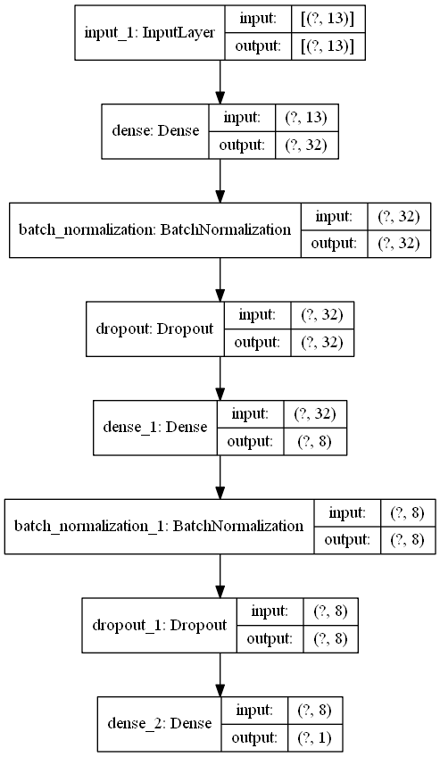

```python
from tensorflow import keras
import numpy as np
from pyradox import densenets
```


```python
inputs = keras.Input(shape=(13,))
x = densenets.DenselyConnectedNetwork([32, 8], batch_normalization=True, dropout=0.2)(inputs)
outputs = keras.layers.Dense(1)(x)

model = keras.models.Model(inputs=inputs, outputs=outputs) 
```


```python
model.summary()
keras.utils.plot_model(model, show_shapes=True, expand_nested=True)
```

    Model: "model"
    _________________________________________________________________
    Layer (type)                 Output Shape              Param #   
    =================================================================
    input_1 (InputLayer)         [(None, 13)]              0         
    _________________________________________________________________
    dense (Dense)                (None, 32)                448       
    _________________________________________________________________
    batch_normalization (BatchNo (None, 32)                128       
    _________________________________________________________________
    dropout (Dropout)            (None, 32)                0         
    _________________________________________________________________
    dense_1 (Dense)              (None, 8)                 264       
    _________________________________________________________________
    batch_normalization_1 (Batch (None, 8)                 32        
    _________________________________________________________________
    dropout_1 (Dropout)          (None, 8)                 0         
    _________________________________________________________________
    dense_2 (Dense)              (None, 1)                 9         
    =================================================================
    Total params: 881
    Trainable params: 801
    Non-trainable params: 80
    _________________________________________________________________
    



