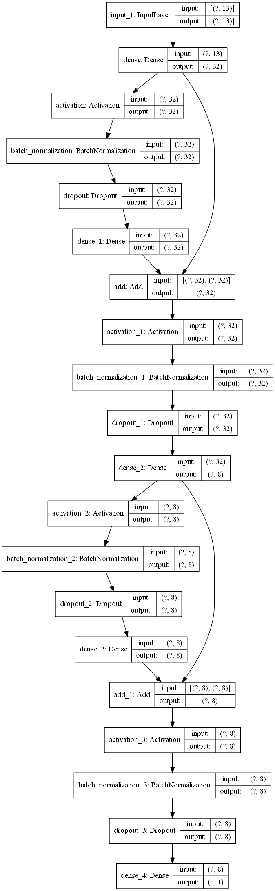

```python
from tensorflow import keras
import numpy as np
from pyradox import densenets
```


```python
inputs = keras.Input(shape=(13,))
x = densenets.DenselyConnectedResnet([32, 8], batch_normalization=True, dropout=0.2)(inputs)
outputs = keras.layers.Dense(1)(x)

model = keras.models.Model(inputs=inputs, outputs=outputs) 
```


```python
model.summary()
keras.utils.plot_model(model, show_shapes=True, expand_nested=True)
```

    Model: "model"
    __________________________________________________________________________________________________
    Layer (type)                    Output Shape         Param #     Connected to                     
    ==================================================================================================
    input_1 (InputLayer)            [(None, 13)]         0                                            
    __________________________________________________________________________________________________
    dense (Dense)                   (None, 32)           448         input_1[0][0]                    
    __________________________________________________________________________________________________
    activation (Activation)         (None, 32)           0           dense[0][0]                      
    __________________________________________________________________________________________________
    batch_normalization (BatchNorma (None, 32)           128         activation[0][0]                 
    __________________________________________________________________________________________________
    dropout (Dropout)               (None, 32)           0           batch_normalization[0][0]        
    __________________________________________________________________________________________________
    dense_1 (Dense)                 (None, 32)           1056        dropout[0][0]                    
    __________________________________________________________________________________________________
    add (Add)                       (None, 32)           0           dense[0][0]                      
                                                                     dense_1[0][0]                    
    __________________________________________________________________________________________________
    activation_1 (Activation)       (None, 32)           0           add[0][0]                        
    __________________________________________________________________________________________________
    batch_normalization_1 (BatchNor (None, 32)           128         activation_1[0][0]               
    __________________________________________________________________________________________________
    dropout_1 (Dropout)             (None, 32)           0           batch_normalization_1[0][0]      
    __________________________________________________________________________________________________
    dense_2 (Dense)                 (None, 8)            264         dropout_1[0][0]                  
    __________________________________________________________________________________________________
    activation_2 (Activation)       (None, 8)            0           dense_2[0][0]                    
    __________________________________________________________________________________________________
    batch_normalization_2 (BatchNor (None, 8)            32          activation_2[0][0]               
    __________________________________________________________________________________________________
    dropout_2 (Dropout)             (None, 8)            0           batch_normalization_2[0][0]      
    __________________________________________________________________________________________________
    dense_3 (Dense)                 (None, 8)            72          dropout_2[0][0]                  
    __________________________________________________________________________________________________
    add_1 (Add)                     (None, 8)            0           dense_2[0][0]                    
                                                                     dense_3[0][0]                    
    __________________________________________________________________________________________________
    activation_3 (Activation)       (None, 8)            0           add_1[0][0]                      
    __________________________________________________________________________________________________
    batch_normalization_3 (BatchNor (None, 8)            32          activation_3[0][0]               
    __________________________________________________________________________________________________
    dropout_3 (Dropout)             (None, 8)            0           batch_normalization_3[0][0]      
    __________________________________________________________________________________________________
    dense_4 (Dense)                 (None, 1)            9           dropout_3[0][0]                  
    ==================================================================================================
    Total params: 2,169
    Trainable params: 2,009
    Non-trainable params: 160
    __________________________________________________________________________________________________
    



