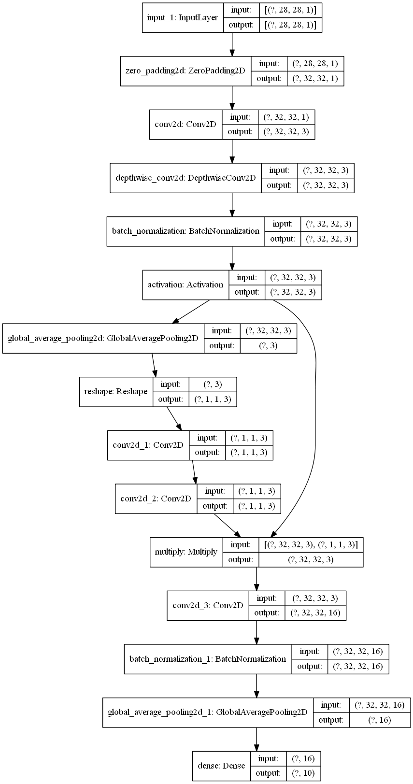

```python
from tensorflow import keras
import numpy as np
from pyradox import modules
```


```python
inputs = keras.Input(shape=(28, 28, 1))
x = keras.layers.ZeroPadding2D(2)(inputs)         # padding to increase dimenstions to 32x32
x = keras.layers.Conv2D(3, 1, padding='same')(x)  # increasing the number of channels to 3
x = modules.EfficientNetBlock(filters_in=3)(x)
x = keras.layers.GlobalAvgPool2D()(x)
outputs = keras.layers.Dense(10, activation="softmax")(x)

model = keras.models.Model(inputs=inputs, outputs=outputs) 
```


```python
model.summary()
keras.utils.plot_model(model, show_shapes=True, expand_nested=True)
```

    Model: "model"
    __________________________________________________________________________________________________
    Layer (type)                    Output Shape         Param #     Connected to                     
    ==================================================================================================
    input_1 (InputLayer)            [(None, 28, 28, 1)]  0                                            
    __________________________________________________________________________________________________
    zero_padding2d (ZeroPadding2D)  (None, 32, 32, 1)    0           input_1[0][0]                    
    __________________________________________________________________________________________________
    conv2d (Conv2D)                 (None, 32, 32, 3)    6           zero_padding2d[0][0]             
    __________________________________________________________________________________________________
    depthwise_conv2d (DepthwiseConv (None, 32, 32, 3)    27          conv2d[0][0]                     
    __________________________________________________________________________________________________
    batch_normalization (BatchNorma (None, 32, 32, 3)    12          depthwise_conv2d[0][0]           
    __________________________________________________________________________________________________
    activation (Activation)         (None, 32, 32, 3)    0           batch_normalization[0][0]        
    __________________________________________________________________________________________________
    global_average_pooling2d (Globa (None, 3)            0           activation[0][0]                 
    __________________________________________________________________________________________________
    reshape (Reshape)               (None, 1, 1, 3)      0           global_average_pooling2d[0][0]   
    __________________________________________________________________________________________________
    conv2d_1 (Conv2D)               (None, 1, 1, 3)      12          reshape[0][0]                    
    __________________________________________________________________________________________________
    conv2d_2 (Conv2D)               (None, 1, 1, 3)      12          conv2d_1[0][0]                   
    __________________________________________________________________________________________________
    multiply (Multiply)             (None, 32, 32, 3)    0           activation[0][0]                 
                                                                     conv2d_2[0][0]                   
    __________________________________________________________________________________________________
    conv2d_3 (Conv2D)               (None, 32, 32, 16)   48          multiply[0][0]                   
    __________________________________________________________________________________________________
    batch_normalization_1 (BatchNor (None, 32, 32, 16)   64          conv2d_3[0][0]                   
    __________________________________________________________________________________________________
    global_average_pooling2d_1 (Glo (None, 16)           0           batch_normalization_1[0][0]      
    __________________________________________________________________________________________________
    dense (Dense)                   (None, 10)           170         global_average_pooling2d_1[0][0] 
    ==================================================================================================
    Total params: 351
    Trainable params: 313
    Non-trainable params: 38
    __________________________________________________________________________________________________
    



