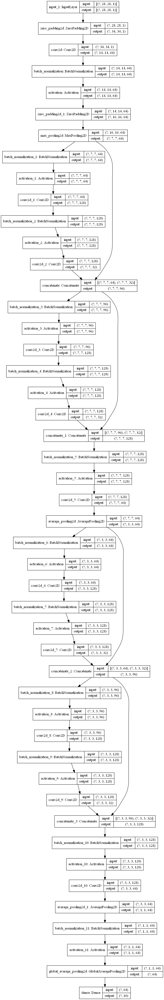

```python
from tensorflow import keras
import numpy as np
from pyradox import convnets
```


```python
inputs = keras.Input(shape=(28, 28, 1))
x = convnets.GeneralizedDenseNets([2, 2], use_bias=True)(inputs)
x = keras.layers.GlobalAvgPool2D()(x)
outputs = keras.layers.Dense(10, activation="softmax")(x)

model = keras.models.Model(inputs=inputs, outputs=outputs) 
```


```python
model.summary()
keras.utils.plot_model(model, show_shapes=True, expand_nested=True)
```

    Model: "model"
    __________________________________________________________________________________________________
    Layer (type)                    Output Shape         Param #     Connected to                     
    ==================================================================================================
    input_1 (InputLayer)            [(None, 28, 28, 1)]  0                                            
    __________________________________________________________________________________________________
    zero_padding2d (ZeroPadding2D)  (None, 34, 34, 1)    0           input_1[0][0]                    
    __________________________________________________________________________________________________
    conv2d (Conv2D)                 (None, 14, 14, 64)   3200        zero_padding2d[0][0]             
    __________________________________________________________________________________________________
    batch_normalization (BatchNorma (None, 14, 14, 64)   256         conv2d[0][0]                     
    __________________________________________________________________________________________________
    activation (Activation)         (None, 14, 14, 64)   0           batch_normalization[0][0]        
    __________________________________________________________________________________________________
    zero_padding2d_1 (ZeroPadding2D (None, 16, 16, 64)   0           activation[0][0]                 
    __________________________________________________________________________________________________
    max_pooling2d (MaxPooling2D)    (None, 7, 7, 64)     0           zero_padding2d_1[0][0]           
    __________________________________________________________________________________________________
    batch_normalization_1 (BatchNor (None, 7, 7, 64)     256         max_pooling2d[0][0]              
    __________________________________________________________________________________________________
    activation_1 (Activation)       (None, 7, 7, 64)     0           batch_normalization_1[0][0]      
    __________________________________________________________________________________________________
    conv2d_1 (Conv2D)               (None, 7, 7, 128)    8192        activation_1[0][0]               
    __________________________________________________________________________________________________
    batch_normalization_2 (BatchNor (None, 7, 7, 128)    512         conv2d_1[0][0]                   
    __________________________________________________________________________________________________
    activation_2 (Activation)       (None, 7, 7, 128)    0           batch_normalization_2[0][0]      
    __________________________________________________________________________________________________
    conv2d_2 (Conv2D)               (None, 7, 7, 32)     36864       activation_2[0][0]               
    __________________________________________________________________________________________________
    concatenate (Concatenate)       (None, 7, 7, 96)     0           max_pooling2d[0][0]              
                                                                     conv2d_2[0][0]                   
    __________________________________________________________________________________________________
    batch_normalization_3 (BatchNor (None, 7, 7, 96)     384         concatenate[0][0]                
    __________________________________________________________________________________________________
    activation_3 (Activation)       (None, 7, 7, 96)     0           batch_normalization_3[0][0]      
    __________________________________________________________________________________________________
    conv2d_3 (Conv2D)               (None, 7, 7, 128)    12288       activation_3[0][0]               
    __________________________________________________________________________________________________
    batch_normalization_4 (BatchNor (None, 7, 7, 128)    512         conv2d_3[0][0]                   
    __________________________________________________________________________________________________
    activation_4 (Activation)       (None, 7, 7, 128)    0           batch_normalization_4[0][0]      
    __________________________________________________________________________________________________
    conv2d_4 (Conv2D)               (None, 7, 7, 32)     36864       activation_4[0][0]               
    __________________________________________________________________________________________________
    concatenate_1 (Concatenate)     (None, 7, 7, 128)    0           concatenate[0][0]                
                                                                     conv2d_4[0][0]                   
    __________________________________________________________________________________________________
    batch_normalization_5 (BatchNor (None, 7, 7, 128)    512         concatenate_1[0][0]              
    __________________________________________________________________________________________________
    activation_5 (Activation)       (None, 7, 7, 128)    0           batch_normalization_5[0][0]      
    __________________________________________________________________________________________________
    conv2d_5 (Conv2D)               (None, 7, 7, 64)     8256        activation_5[0][0]               
    __________________________________________________________________________________________________
    average_pooling2d (AveragePooli (None, 3, 3, 64)     0           conv2d_5[0][0]                   
    __________________________________________________________________________________________________
    batch_normalization_6 (BatchNor (None, 3, 3, 64)     256         average_pooling2d[0][0]          
    __________________________________________________________________________________________________
    activation_6 (Activation)       (None, 3, 3, 64)     0           batch_normalization_6[0][0]      
    __________________________________________________________________________________________________
    conv2d_6 (Conv2D)               (None, 3, 3, 128)    8192        activation_6[0][0]               
    __________________________________________________________________________________________________
    batch_normalization_7 (BatchNor (None, 3, 3, 128)    512         conv2d_6[0][0]                   
    __________________________________________________________________________________________________
    activation_7 (Activation)       (None, 3, 3, 128)    0           batch_normalization_7[0][0]      
    __________________________________________________________________________________________________
    conv2d_7 (Conv2D)               (None, 3, 3, 32)     36864       activation_7[0][0]               
    __________________________________________________________________________________________________
    concatenate_2 (Concatenate)     (None, 3, 3, 96)     0           average_pooling2d[0][0]          
                                                                     conv2d_7[0][0]                   
    __________________________________________________________________________________________________
    batch_normalization_8 (BatchNor (None, 3, 3, 96)     384         concatenate_2[0][0]              
    __________________________________________________________________________________________________
    activation_8 (Activation)       (None, 3, 3, 96)     0           batch_normalization_8[0][0]      
    __________________________________________________________________________________________________
    conv2d_8 (Conv2D)               (None, 3, 3, 128)    12288       activation_8[0][0]               
    __________________________________________________________________________________________________
    batch_normalization_9 (BatchNor (None, 3, 3, 128)    512         conv2d_8[0][0]                   
    __________________________________________________________________________________________________
    activation_9 (Activation)       (None, 3, 3, 128)    0           batch_normalization_9[0][0]      
    __________________________________________________________________________________________________
    conv2d_9 (Conv2D)               (None, 3, 3, 32)     36864       activation_9[0][0]               
    __________________________________________________________________________________________________
    concatenate_3 (Concatenate)     (None, 3, 3, 128)    0           concatenate_2[0][0]              
                                                                     conv2d_9[0][0]                   
    __________________________________________________________________________________________________
    batch_normalization_10 (BatchNo (None, 3, 3, 128)    512         concatenate_3[0][0]              
    __________________________________________________________________________________________________
    activation_10 (Activation)      (None, 3, 3, 128)    0           batch_normalization_10[0][0]     
    __________________________________________________________________________________________________
    conv2d_10 (Conv2D)              (None, 3, 3, 64)     8256        activation_10[0][0]              
    __________________________________________________________________________________________________
    average_pooling2d_1 (AveragePoo (None, 1, 1, 64)     0           conv2d_10[0][0]                  
    __________________________________________________________________________________________________
    batch_normalization_11 (BatchNo (None, 1, 1, 64)     256         average_pooling2d_1[0][0]        
    __________________________________________________________________________________________________
    activation_11 (Activation)      (None, 1, 1, 64)     0           batch_normalization_11[0][0]     
    __________________________________________________________________________________________________
    global_average_pooling2d (Globa (None, 64)           0           activation_11[0][0]              
    __________________________________________________________________________________________________
    dense (Dense)                   (None, 10)           650         global_average_pooling2d[0][0]   
    ==================================================================================================
    Total params: 213,642
    Trainable params: 211,210
    Non-trainable params: 2,432
    __________________________________________________________________________________________________
    



