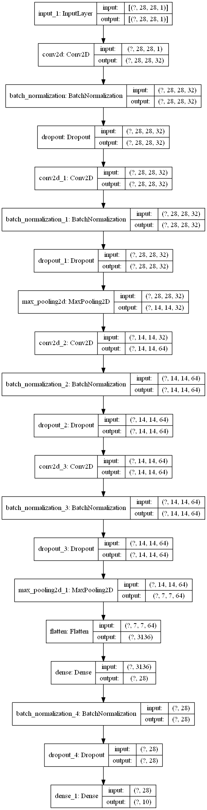

```python
from tensorflow import keras
import numpy as np
from pyradox import convnets
```


```python
inputs = keras.Input(shape=(28, 28, 1))
x = convnets.GeneralizedVGG(
    conv_config=[(2, 32), (2, 64)], dense_config=[28], 
    conv_batch_norm=True, conv_dropout=0.2, dense_batch_norm=True, dense_dropout=0.2
)(inputs)
outputs = keras.layers.Dense(10, activation="softmax")(x)

model = keras.models.Model(inputs=inputs, outputs=outputs) 
```


```python
model.summary()
keras.utils.plot_model(model, show_shapes=True, expand_nested=True)
```

    Model: "model"
    _________________________________________________________________
    Layer (type)                 Output Shape              Param #   
    =================================================================
    input_1 (InputLayer)         [(None, 28, 28, 1)]       0         
    _________________________________________________________________
    conv2d (Conv2D)              (None, 28, 28, 32)        320       
    _________________________________________________________________
    batch_normalization (BatchNo (None, 28, 28, 32)        128       
    _________________________________________________________________
    dropout (Dropout)            (None, 28, 28, 32)        0         
    _________________________________________________________________
    conv2d_1 (Conv2D)            (None, 28, 28, 32)        9248      
    _________________________________________________________________
    batch_normalization_1 (Batch (None, 28, 28, 32)        128       
    _________________________________________________________________
    dropout_1 (Dropout)          (None, 28, 28, 32)        0         
    _________________________________________________________________
    max_pooling2d (MaxPooling2D) (None, 14, 14, 32)        0         
    _________________________________________________________________
    conv2d_2 (Conv2D)            (None, 14, 14, 64)        18496     
    _________________________________________________________________
    batch_normalization_2 (Batch (None, 14, 14, 64)        256       
    _________________________________________________________________
    dropout_2 (Dropout)          (None, 14, 14, 64)        0         
    _________________________________________________________________
    conv2d_3 (Conv2D)            (None, 14, 14, 64)        36928     
    _________________________________________________________________
    batch_normalization_3 (Batch (None, 14, 14, 64)        256       
    _________________________________________________________________
    dropout_3 (Dropout)          (None, 14, 14, 64)        0         
    _________________________________________________________________
    max_pooling2d_1 (MaxPooling2 (None, 7, 7, 64)          0         
    _________________________________________________________________
    flatten (Flatten)            (None, 3136)              0         
    _________________________________________________________________
    dense (Dense)                (None, 28)                87836     
    _________________________________________________________________
    batch_normalization_4 (Batch (None, 28)                112       
    _________________________________________________________________
    dropout_4 (Dropout)          (None, 28)                0         
    _________________________________________________________________
    dense_1 (Dense)              (None, 10)                290       
    =================================================================
    Total params: 153,998
    Trainable params: 153,558
    Non-trainable params: 440
    _________________________________________________________________
    



