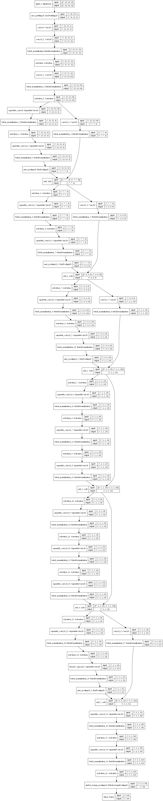

```python
from tensorflow import keras
import numpy as np
from pyradox import convnets
```


```python
inputs = keras.Input(shape=(28, 28, 1))
x = keras.layers.ZeroPadding2D(2)(inputs)                # padding to increase dimenstions to 32x32
x = keras.layers.Conv2D(3, (1, 1), padding='same')(x)    # increasing the number of channels to 3
x = convnets.GeneralizedXception(channel_coefficient=4, depth_coefficient=2)(x)
x = keras.layers.GlobalAveragePooling2D()(x)
outputs = keras.layers.Dense(10, activation="softmax")(x)

model = keras.models.Model(inputs=inputs, outputs=outputs) 
```


```python
model.summary()
keras.utils.plot_model(model, show_shapes=True, expand_nested=True)
```

    Model: "model"
    __________________________________________________________________________________________________
    Layer (type)                    Output Shape         Param #     Connected to                     
    ==================================================================================================
    input_1 (InputLayer)            [(None, 28, 28, 1)]  0                                            
    __________________________________________________________________________________________________
    zero_padding2d (ZeroPadding2D)  (None, 32, 32, 1)    0           input_1[0][0]                    
    __________________________________________________________________________________________________
    conv2d (Conv2D)                 (None, 32, 32, 3)    6           zero_padding2d[0][0]             
    __________________________________________________________________________________________________
    conv2d_1 (Conv2D)               (None, 15, 15, 32)   864         conv2d[0][0]                     
    __________________________________________________________________________________________________
    batch_normalization (BatchNorma (None, 15, 15, 32)   128         conv2d_1[0][0]                   
    __________________________________________________________________________________________________
    activation (Activation)         (None, 15, 15, 32)   0           batch_normalization[0][0]        
    __________________________________________________________________________________________________
    conv2d_2 (Conv2D)               (None, 13, 13, 64)   18432       activation[0][0]                 
    __________________________________________________________________________________________________
    batch_normalization_1 (BatchNor (None, 13, 13, 64)   256         conv2d_2[0][0]                   
    __________________________________________________________________________________________________
    activation_1 (Activation)       (None, 13, 13, 64)   0           batch_normalization_1[0][0]      
    __________________________________________________________________________________________________
    separable_conv2d (SeparableConv (None, 13, 13, 4)    832         activation_1[0][0]               
    __________________________________________________________________________________________________
    batch_normalization_3 (BatchNor (None, 13, 13, 4)    16          separable_conv2d[0][0]           
    __________________________________________________________________________________________________
    activation_2 (Activation)       (None, 13, 13, 4)    0           batch_normalization_3[0][0]      
    __________________________________________________________________________________________________
    separable_conv2d_1 (SeparableCo (None, 13, 13, 4)    52          activation_2[0][0]               
    __________________________________________________________________________________________________
    batch_normalization_4 (BatchNor (None, 13, 13, 4)    16          separable_conv2d_1[0][0]         
    __________________________________________________________________________________________________
    conv2d_3 (Conv2D)               (None, 7, 7, 4)      256         activation_1[0][0]               
    __________________________________________________________________________________________________
    max_pooling2d (MaxPooling2D)    (None, 7, 7, 4)      0           batch_normalization_4[0][0]      
    __________________________________________________________________________________________________
    batch_normalization_2 (BatchNor (None, 7, 7, 4)      16          conv2d_3[0][0]                   
    __________________________________________________________________________________________________
    add (Add)                       (None, 7, 7, 4)      0           max_pooling2d[0][0]              
                                                                     batch_normalization_2[0][0]      
    __________________________________________________________________________________________________
    activation_3 (Activation)       (None, 7, 7, 4)      0           add[0][0]                        
    __________________________________________________________________________________________________
    separable_conv2d_2 (SeparableCo (None, 7, 7, 8)      68          activation_3[0][0]               
    __________________________________________________________________________________________________
    batch_normalization_6 (BatchNor (None, 7, 7, 8)      32          separable_conv2d_2[0][0]         
    __________________________________________________________________________________________________
    activation_4 (Activation)       (None, 7, 7, 8)      0           batch_normalization_6[0][0]      
    __________________________________________________________________________________________________
    separable_conv2d_3 (SeparableCo (None, 7, 7, 8)      136         activation_4[0][0]               
    __________________________________________________________________________________________________
    batch_normalization_7 (BatchNor (None, 7, 7, 8)      32          separable_conv2d_3[0][0]         
    __________________________________________________________________________________________________
    conv2d_4 (Conv2D)               (None, 4, 4, 8)      32          add[0][0]                        
    __________________________________________________________________________________________________
    max_pooling2d_1 (MaxPooling2D)  (None, 4, 4, 8)      0           batch_normalization_7[0][0]      
    __________________________________________________________________________________________________
    batch_normalization_5 (BatchNor (None, 4, 4, 8)      32          conv2d_4[0][0]                   
    __________________________________________________________________________________________________
    add_1 (Add)                     (None, 4, 4, 8)      0           max_pooling2d_1[0][0]            
                                                                     batch_normalization_5[0][0]      
    __________________________________________________________________________________________________
    activation_5 (Activation)       (None, 4, 4, 8)      0           add_1[0][0]                      
    __________________________________________________________________________________________________
    separable_conv2d_4 (SeparableCo (None, 4, 4, 24)     264         activation_5[0][0]               
    __________________________________________________________________________________________________
    batch_normalization_9 (BatchNor (None, 4, 4, 24)     96          separable_conv2d_4[0][0]         
    __________________________________________________________________________________________________
    activation_6 (Activation)       (None, 4, 4, 24)     0           batch_normalization_9[0][0]      
    __________________________________________________________________________________________________
    separable_conv2d_5 (SeparableCo (None, 4, 4, 24)     792         activation_6[0][0]               
    __________________________________________________________________________________________________
    batch_normalization_10 (BatchNo (None, 4, 4, 24)     96          separable_conv2d_5[0][0]         
    __________________________________________________________________________________________________
    conv2d_5 (Conv2D)               (None, 2, 2, 24)     192         add_1[0][0]                      
    __________________________________________________________________________________________________
    max_pooling2d_2 (MaxPooling2D)  (None, 2, 2, 24)     0           batch_normalization_10[0][0]     
    __________________________________________________________________________________________________
    batch_normalization_8 (BatchNor (None, 2, 2, 24)     96          conv2d_5[0][0]                   
    __________________________________________________________________________________________________
    add_2 (Add)                     (None, 2, 2, 24)     0           max_pooling2d_2[0][0]            
                                                                     batch_normalization_8[0][0]      
    __________________________________________________________________________________________________
    activation_7 (Activation)       (None, 2, 2, 24)     0           add_2[0][0]                      
    __________________________________________________________________________________________________
    separable_conv2d_6 (SeparableCo (None, 2, 2, 24)     792         activation_7[0][0]               
    __________________________________________________________________________________________________
    batch_normalization_11 (BatchNo (None, 2, 2, 24)     96          separable_conv2d_6[0][0]         
    __________________________________________________________________________________________________
    activation_8 (Activation)       (None, 2, 2, 24)     0           batch_normalization_11[0][0]     
    __________________________________________________________________________________________________
    separable_conv2d_7 (SeparableCo (None, 2, 2, 24)     792         activation_8[0][0]               
    __________________________________________________________________________________________________
    batch_normalization_12 (BatchNo (None, 2, 2, 24)     96          separable_conv2d_7[0][0]         
    __________________________________________________________________________________________________
    activation_9 (Activation)       (None, 2, 2, 24)     0           batch_normalization_12[0][0]     
    __________________________________________________________________________________________________
    separable_conv2d_8 (SeparableCo (None, 2, 2, 24)     792         activation_9[0][0]               
    __________________________________________________________________________________________________
    batch_normalization_13 (BatchNo (None, 2, 2, 24)     96          separable_conv2d_8[0][0]         
    __________________________________________________________________________________________________
    add_3 (Add)                     (None, 2, 2, 24)     0           batch_normalization_13[0][0]     
                                                                     add_2[0][0]                      
    __________________________________________________________________________________________________
    activation_10 (Activation)      (None, 2, 2, 24)     0           add_3[0][0]                      
    __________________________________________________________________________________________________
    separable_conv2d_9 (SeparableCo (None, 2, 2, 24)     792         activation_10[0][0]              
    __________________________________________________________________________________________________
    batch_normalization_14 (BatchNo (None, 2, 2, 24)     96          separable_conv2d_9[0][0]         
    __________________________________________________________________________________________________
    activation_11 (Activation)      (None, 2, 2, 24)     0           batch_normalization_14[0][0]     
    __________________________________________________________________________________________________
    separable_conv2d_10 (SeparableC (None, 2, 2, 24)     792         activation_11[0][0]              
    __________________________________________________________________________________________________
    batch_normalization_15 (BatchNo (None, 2, 2, 24)     96          separable_conv2d_10[0][0]        
    __________________________________________________________________________________________________
    activation_12 (Activation)      (None, 2, 2, 24)     0           batch_normalization_15[0][0]     
    __________________________________________________________________________________________________
    separable_conv2d_11 (SeparableC (None, 2, 2, 24)     792         activation_12[0][0]              
    __________________________________________________________________________________________________
    batch_normalization_16 (BatchNo (None, 2, 2, 24)     96          separable_conv2d_11[0][0]        
    __________________________________________________________________________________________________
    add_4 (Add)                     (None, 2, 2, 24)     0           batch_normalization_16[0][0]     
                                                                     add_3[0][0]                      
    __________________________________________________________________________________________________
    activation_13 (Activation)      (None, 2, 2, 24)     0           add_4[0][0]                      
    __________________________________________________________________________________________________
    separable_conv2d_12 (SeparableC (None, 2, 2, 24)     792         activation_13[0][0]              
    __________________________________________________________________________________________________
    batch_normalization_18 (BatchNo (None, 2, 2, 24)     96          separable_conv2d_12[0][0]        
    __________________________________________________________________________________________________
    activation_14 (Activation)      (None, 2, 2, 24)     0           batch_normalization_18[0][0]     
    __________________________________________________________________________________________________
    block13_sepconv2 (SeparableConv (None, 2, 2, 32)     984         activation_14[0][0]              
    __________________________________________________________________________________________________
    batch_normalization_19 (BatchNo (None, 2, 2, 32)     128         block13_sepconv2[0][0]           
    __________________________________________________________________________________________________
    conv2d_6 (Conv2D)               (None, 1, 1, 32)     768         add_4[0][0]                      
    __________________________________________________________________________________________________
    max_pooling2d_3 (MaxPooling2D)  (None, 1, 1, 32)     0           batch_normalization_19[0][0]     
    __________________________________________________________________________________________________
    batch_normalization_17 (BatchNo (None, 1, 1, 32)     128         conv2d_6[0][0]                   
    __________________________________________________________________________________________________
    add_5 (Add)                     (None, 1, 1, 32)     0           max_pooling2d_3[0][0]            
                                                                     batch_normalization_17[0][0]     
    __________________________________________________________________________________________________
    separable_conv2d_13 (SeparableC (None, 1, 1, 48)     1824        add_5[0][0]                      
    __________________________________________________________________________________________________
    batch_normalization_20 (BatchNo (None, 1, 1, 48)     192         separable_conv2d_13[0][0]        
    __________________________________________________________________________________________________
    activation_15 (Activation)      (None, 1, 1, 48)     0           batch_normalization_20[0][0]     
    __________________________________________________________________________________________________
    separable_conv2d_14 (SeparableC (None, 1, 1, 64)     3504        activation_15[0][0]              
    __________________________________________________________________________________________________
    batch_normalization_21 (BatchNo (None, 1, 1, 64)     256         separable_conv2d_14[0][0]        
    __________________________________________________________________________________________________
    activation_16 (Activation)      (None, 1, 1, 64)     0           batch_normalization_21[0][0]     
    __________________________________________________________________________________________________
    global_average_pooling2d (Globa (None, 64)           0           activation_16[0][0]              
    __________________________________________________________________________________________________
    dense (Dense)                   (None, 10)           650         global_average_pooling2d[0][0]   
    ==================================================================================================
    Total params: 37,392
    Trainable params: 36,296
    Non-trainable params: 1,096
    __________________________________________________________________________________________________
    



