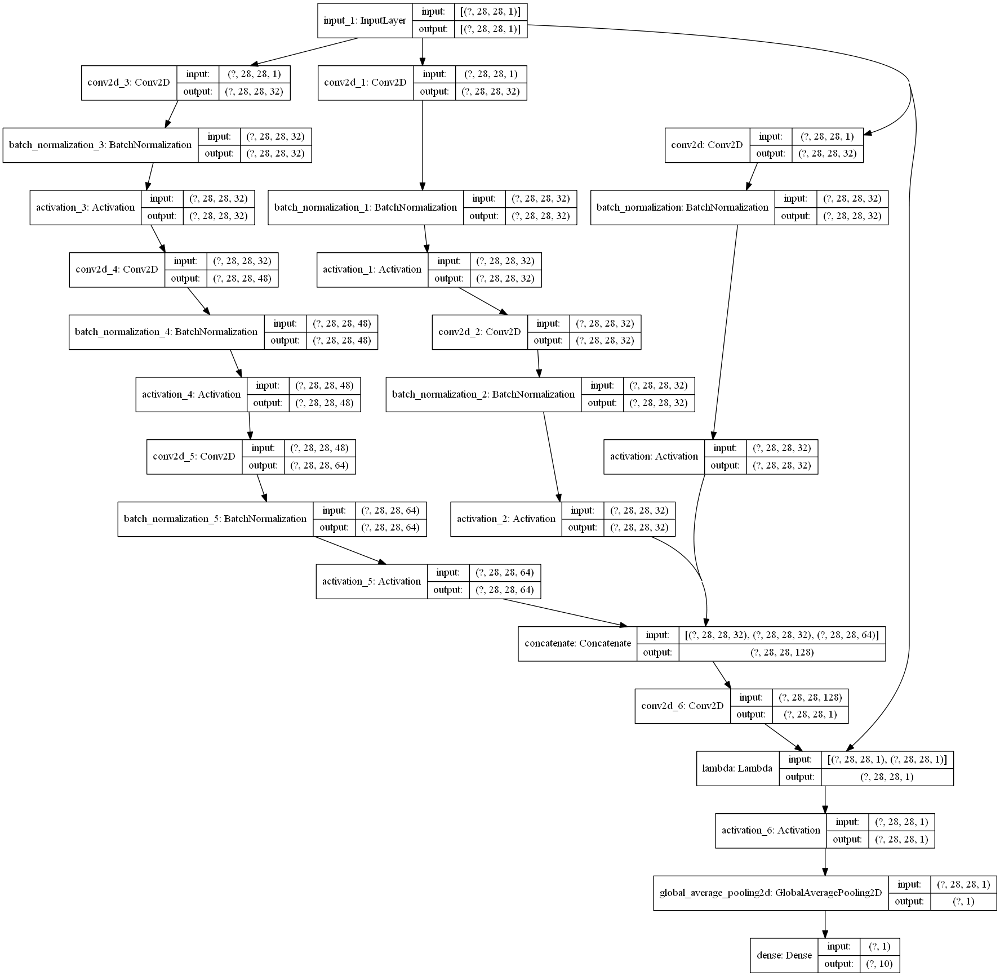

```python
from tensorflow import keras
import numpy as np
from pyradox import modules
```


```python
inputs = keras.Input(shape=(28, 28, 1))
x = modules.InceptionResNetBlock(1.0, 'block35')(inputs)
x = keras.layers.GlobalAvgPool2D()(x)
outputs = keras.layers.Dense(10, activation="softmax")(x)

model = keras.models.Model(inputs=inputs, outputs=outputs) 
```


```python
model.summary()
keras.utils.plot_model(model, show_shapes=True, expand_nested=True)
```

    Model: "model"
    __________________________________________________________________________________________________
    Layer (type)                    Output Shape         Param #     Connected to                     
    ==================================================================================================
    input_1 (InputLayer)            [(None, 28, 28, 1)]  0                                            
    __________________________________________________________________________________________________
    conv2d_3 (Conv2D)               (None, 28, 28, 32)   32          input_1[0][0]                    
    __________________________________________________________________________________________________
    batch_normalization_3 (BatchNor (None, 28, 28, 32)   96          conv2d_3[0][0]                   
    __________________________________________________________________________________________________
    activation_3 (Activation)       (None, 28, 28, 32)   0           batch_normalization_3[0][0]      
    __________________________________________________________________________________________________
    conv2d_1 (Conv2D)               (None, 28, 28, 32)   32          input_1[0][0]                    
    __________________________________________________________________________________________________
    conv2d_4 (Conv2D)               (None, 28, 28, 48)   13824       activation_3[0][0]               
    __________________________________________________________________________________________________
    batch_normalization_1 (BatchNor (None, 28, 28, 32)   96          conv2d_1[0][0]                   
    __________________________________________________________________________________________________
    batch_normalization_4 (BatchNor (None, 28, 28, 48)   144         conv2d_4[0][0]                   
    __________________________________________________________________________________________________
    activation_1 (Activation)       (None, 28, 28, 32)   0           batch_normalization_1[0][0]      
    __________________________________________________________________________________________________
    activation_4 (Activation)       (None, 28, 28, 48)   0           batch_normalization_4[0][0]      
    __________________________________________________________________________________________________
    conv2d (Conv2D)                 (None, 28, 28, 32)   32          input_1[0][0]                    
    __________________________________________________________________________________________________
    conv2d_2 (Conv2D)               (None, 28, 28, 32)   9216        activation_1[0][0]               
    __________________________________________________________________________________________________
    conv2d_5 (Conv2D)               (None, 28, 28, 64)   27648       activation_4[0][0]               
    __________________________________________________________________________________________________
    batch_normalization (BatchNorma (None, 28, 28, 32)   96          conv2d[0][0]                     
    __________________________________________________________________________________________________
    batch_normalization_2 (BatchNor (None, 28, 28, 32)   96          conv2d_2[0][0]                   
    __________________________________________________________________________________________________
    batch_normalization_5 (BatchNor (None, 28, 28, 64)   192         conv2d_5[0][0]                   
    __________________________________________________________________________________________________
    activation (Activation)         (None, 28, 28, 32)   0           batch_normalization[0][0]        
    __________________________________________________________________________________________________
    activation_2 (Activation)       (None, 28, 28, 32)   0           batch_normalization_2[0][0]      
    __________________________________________________________________________________________________
    activation_5 (Activation)       (None, 28, 28, 64)   0           batch_normalization_5[0][0]      
    __________________________________________________________________________________________________
    concatenate (Concatenate)       (None, 28, 28, 128)  0           activation[0][0]                 
                                                                     activation_2[0][0]               
                                                                     activation_5[0][0]               
    __________________________________________________________________________________________________
    conv2d_6 (Conv2D)               (None, 28, 28, 1)    129         concatenate[0][0]                
    __________________________________________________________________________________________________
    lambda (Lambda)                 (None, 28, 28, 1)    0           input_1[0][0]                    
                                                                     conv2d_6[0][0]                   
    __________________________________________________________________________________________________
    activation_6 (Activation)       (None, 28, 28, 1)    0           lambda[0][0]                     
    __________________________________________________________________________________________________
    global_average_pooling2d (Globa (None, 1)            0           activation_6[0][0]               
    __________________________________________________________________________________________________
    dense (Dense)                   (None, 10)           20          global_average_pooling2d[0][0]   
    ==================================================================================================
    Total params: 51,653
    Trainable params: 51,173
    Non-trainable params: 480
    __________________________________________________________________________________________________
    



