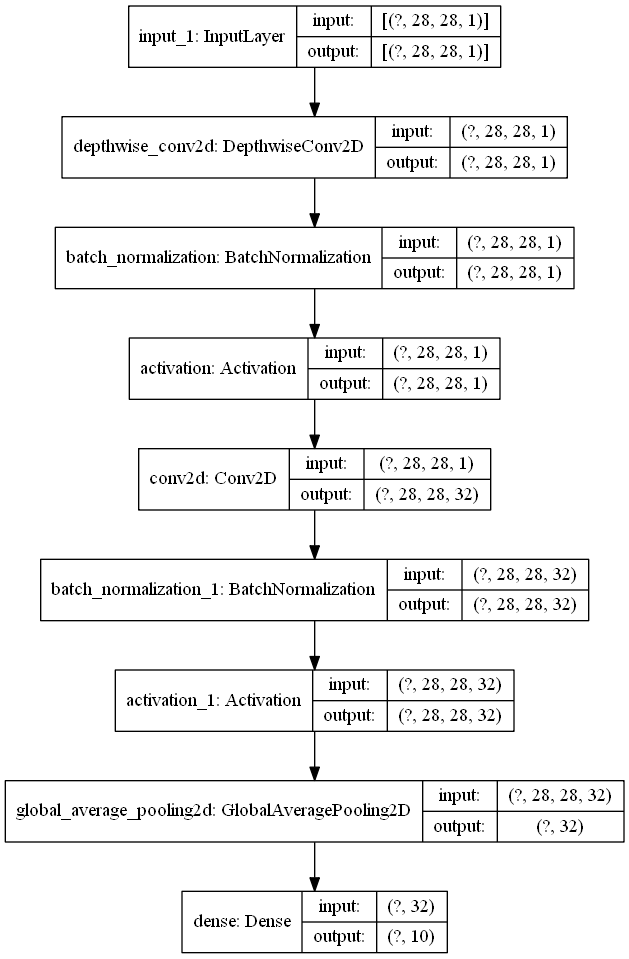

```python
from tensorflow import keras
import numpy as np
from pyradox import modules
```


```python
inputs = keras.Input(shape=(28, 28, 1))
x = modules.MobileNetDepthWiseConvBlock(pointwise_conv_filters=32, alpha=1)(inputs)
x = keras.layers.GlobalAvgPool2D()(x)
outputs = keras.layers.Dense(10, activation="softmax")(x)

model = keras.models.Model(inputs=inputs, outputs=outputs) 
```


```python
model.summary()
keras.utils.plot_model(model, show_shapes=True, expand_nested=True)
```

    Model: "model"
    _________________________________________________________________
    Layer (type)                 Output Shape              Param #   
    =================================================================
    input_1 (InputLayer)         [(None, 28, 28, 1)]       0         
    _________________________________________________________________
    depthwise_conv2d (DepthwiseC (None, 28, 28, 1)         9         
    _________________________________________________________________
    batch_normalization (BatchNo (None, 28, 28, 1)         4         
    _________________________________________________________________
    activation (Activation)      (None, 28, 28, 1)         0         
    _________________________________________________________________
    conv2d (Conv2D)              (None, 28, 28, 32)        32        
    _________________________________________________________________
    batch_normalization_1 (Batch (None, 28, 28, 32)        128       
    _________________________________________________________________
    activation_1 (Activation)    (None, 28, 28, 32)        0         
    _________________________________________________________________
    global_average_pooling2d (Gl (None, 32)                0         
    _________________________________________________________________
    dense (Dense)                (None, 10)                330       
    =================================================================
    Total params: 503
    Trainable params: 437
    Non-trainable params: 66
    _________________________________________________________________
    



