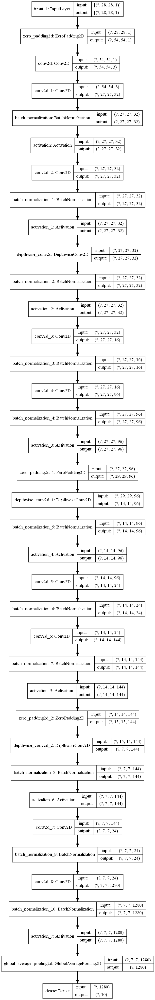

```python
from tensorflow import keras
import numpy as np
from pyradox import convnets
```


```python
inputs = keras.Input(shape=(28, 28, 1))
x = keras.layers.ZeroPadding2D(13)(inputs)         # padding to increase dimenstions to 54x54
x = keras.layers.Conv2D(3, 1, padding='same')(x)  # increasing the number of channels to 3
x = convnets.MobileNetV2([(16, 1, 1), (24, 2, 6), (24, 2, 6)])(x)
x = keras.layers.GlobalAvgPool2D()(x)
outputs = keras.layers.Dense(10, activation="softmax")(x)

model = keras.models.Model(inputs=inputs, outputs=outputs) 
```


```python
model.summary()
keras.utils.plot_model(model, show_shapes=True, expand_nested=True)
```

    Model: "model"
    _________________________________________________________________
    Layer (type)                 Output Shape              Param #   
    =================================================================
    input_1 (InputLayer)         [(None, 28, 28, 1)]       0         
    _________________________________________________________________
    zero_padding2d (ZeroPadding2 (None, 54, 54, 1)         0         
    _________________________________________________________________
    conv2d (Conv2D)              (None, 54, 54, 3)         6         
    _________________________________________________________________
    conv2d_1 (Conv2D)            (None, 27, 27, 32)        864       
    _________________________________________________________________
    batch_normalization (BatchNo (None, 27, 27, 32)        128       
    _________________________________________________________________
    activation (Activation)      (None, 27, 27, 32)        0         
    _________________________________________________________________
    conv2d_2 (Conv2D)            (None, 27, 27, 32)        1024      
    _________________________________________________________________
    batch_normalization_1 (Batch (None, 27, 27, 32)        128       
    _________________________________________________________________
    activation_1 (Activation)    (None, 27, 27, 32)        0         
    _________________________________________________________________
    depthwise_conv2d (DepthwiseC (None, 27, 27, 32)        288       
    _________________________________________________________________
    batch_normalization_2 (Batch (None, 27, 27, 32)        128       
    _________________________________________________________________
    activation_2 (Activation)    (None, 27, 27, 32)        0         
    _________________________________________________________________
    conv2d_3 (Conv2D)            (None, 27, 27, 16)        512       
    _________________________________________________________________
    batch_normalization_3 (Batch (None, 27, 27, 16)        64        
    _________________________________________________________________
    conv2d_4 (Conv2D)            (None, 27, 27, 96)        1536      
    _________________________________________________________________
    batch_normalization_4 (Batch (None, 27, 27, 96)        384       
    _________________________________________________________________
    activation_3 (Activation)    (None, 27, 27, 96)        0         
    _________________________________________________________________
    zero_padding2d_1 (ZeroPaddin (None, 29, 29, 96)        0         
    _________________________________________________________________
    depthwise_conv2d_1 (Depthwis (None, 14, 14, 96)        864       
    _________________________________________________________________
    batch_normalization_5 (Batch (None, 14, 14, 96)        384       
    _________________________________________________________________
    activation_4 (Activation)    (None, 14, 14, 96)        0         
    _________________________________________________________________
    conv2d_5 (Conv2D)            (None, 14, 14, 24)        2304      
    _________________________________________________________________
    batch_normalization_6 (Batch (None, 14, 14, 24)        96        
    _________________________________________________________________
    conv2d_6 (Conv2D)            (None, 14, 14, 144)       3456      
    _________________________________________________________________
    batch_normalization_7 (Batch (None, 14, 14, 144)       576       
    _________________________________________________________________
    activation_5 (Activation)    (None, 14, 14, 144)       0         
    _________________________________________________________________
    zero_padding2d_2 (ZeroPaddin (None, 15, 15, 144)       0         
    _________________________________________________________________
    depthwise_conv2d_2 (Depthwis (None, 7, 7, 144)         1296      
    _________________________________________________________________
    batch_normalization_8 (Batch (None, 7, 7, 144)         576       
    _________________________________________________________________
    activation_6 (Activation)    (None, 7, 7, 144)         0         
    _________________________________________________________________
    conv2d_7 (Conv2D)            (None, 7, 7, 24)          3456      
    _________________________________________________________________
    batch_normalization_9 (Batch (None, 7, 7, 24)          96        
    _________________________________________________________________
    conv2d_8 (Conv2D)            (None, 7, 7, 1280)        30720     
    _________________________________________________________________
    batch_normalization_10 (Batc (None, 7, 7, 1280)        5120      
    _________________________________________________________________
    activation_7 (Activation)    (None, 7, 7, 1280)        0         
    _________________________________________________________________
    global_average_pooling2d (Gl (None, 1280)              0         
    _________________________________________________________________
    dense (Dense)                (None, 10)                12810     
    =================================================================
    Total params: 66,816
    Trainable params: 62,976
    Non-trainable params: 3,840
    _________________________________________________________________
    



