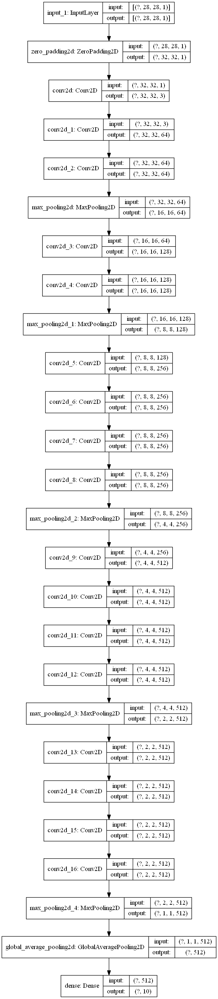

```python
from tensorflow import keras
import numpy as np
from pyradox import convnets
```


```python
inputs = keras.Input(shape=(28, 28, 1))
x = keras.layers.ZeroPadding2D(2)(inputs)                # padding to increase dimenstions to 32x32
x = keras.layers.Conv2D(3, (1, 1), padding='same')(x)    # increasing the number of channels to 3
x = convnets.VGG19(use_dense=False)(x)
x = keras.layers.GlobalAvgPool2D()(x)
outputs = keras.layers.Dense(10, activation="softmax")(x)

model = keras.models.Model(inputs=inputs, outputs=outputs) 
```


```python
model.summary()
keras.utils.plot_model(model, show_shapes=True, expand_nested=True)
```

    Model: "model"
    _________________________________________________________________
    Layer (type)                 Output Shape              Param #   
    =================================================================
    input_1 (InputLayer)         [(None, 28, 28, 1)]       0         
    _________________________________________________________________
    zero_padding2d (ZeroPadding2 (None, 32, 32, 1)         0         
    _________________________________________________________________
    conv2d (Conv2D)              (None, 32, 32, 3)         6         
    _________________________________________________________________
    conv2d_1 (Conv2D)            (None, 32, 32, 64)        1792      
    _________________________________________________________________
    conv2d_2 (Conv2D)            (None, 32, 32, 64)        36928     
    _________________________________________________________________
    max_pooling2d (MaxPooling2D) (None, 16, 16, 64)        0         
    _________________________________________________________________
    conv2d_3 (Conv2D)            (None, 16, 16, 128)       73856     
    _________________________________________________________________
    conv2d_4 (Conv2D)            (None, 16, 16, 128)       147584    
    _________________________________________________________________
    max_pooling2d_1 (MaxPooling2 (None, 8, 8, 128)         0         
    _________________________________________________________________
    conv2d_5 (Conv2D)            (None, 8, 8, 256)         295168    
    _________________________________________________________________
    conv2d_6 (Conv2D)            (None, 8, 8, 256)         590080    
    _________________________________________________________________
    conv2d_7 (Conv2D)            (None, 8, 8, 256)         590080    
    _________________________________________________________________
    conv2d_8 (Conv2D)            (None, 8, 8, 256)         590080    
    _________________________________________________________________
    max_pooling2d_2 (MaxPooling2 (None, 4, 4, 256)         0         
    _________________________________________________________________
    conv2d_9 (Conv2D)            (None, 4, 4, 512)         1180160   
    _________________________________________________________________
    conv2d_10 (Conv2D)           (None, 4, 4, 512)         2359808   
    _________________________________________________________________
    conv2d_11 (Conv2D)           (None, 4, 4, 512)         2359808   
    _________________________________________________________________
    conv2d_12 (Conv2D)           (None, 4, 4, 512)         2359808   
    _________________________________________________________________
    max_pooling2d_3 (MaxPooling2 (None, 2, 2, 512)         0         
    _________________________________________________________________
    conv2d_13 (Conv2D)           (None, 2, 2, 512)         2359808   
    _________________________________________________________________
    conv2d_14 (Conv2D)           (None, 2, 2, 512)         2359808   
    _________________________________________________________________
    conv2d_15 (Conv2D)           (None, 2, 2, 512)         2359808   
    _________________________________________________________________
    conv2d_16 (Conv2D)           (None, 2, 2, 512)         2359808   
    _________________________________________________________________
    max_pooling2d_4 (MaxPooling2 (None, 1, 1, 512)         0         
    _________________________________________________________________
    global_average_pooling2d (Gl (None, 512)               0         
    _________________________________________________________________
    dense (Dense)                (None, 10)                5130      
    =================================================================
    Total params: 20,029,520
    Trainable params: 20,029,520
    Non-trainable params: 0
    _________________________________________________________________
    





